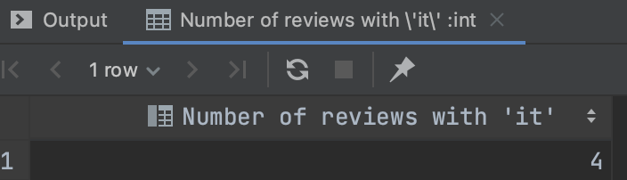

<br><br><br><br><br><br><br><br><br><br><br>
<div style="text-align: center;">

<h1>Database Implementation for Ohmai</h1>
<ul style="list-style-type: none">
<li>Database coursework 2</li>
<li>Student: Li-Hsin Liang</li>
<li>Student ID: LIA21510865</li>
<li><a href="https://github.com/Cindywritescode/ohmai-database" target="_blank">Coursework Link</a></li>
</ul>
</div>

<br><br><br><br><br><br><br><br><br><br><br><br><br><br><br><br><br><br><br>
<hr>

## 1. Database Implementation

We have learned in class how to complete the database with phpMyAdmin. However, I thought it would be great to have
access to additional database tools. Therefore, this coursework is using database IDE (Integrated Development
Environment) DataGrip to complete. For the database server, instead of using XAMPP, I downloaded MySQL to my local
machine and connected the database to DataGrip.

### 1.1 Schema

```mysql
create table accounts
(
    account_id bigint        not null
        primary key,
    name       varchar(1024) null,
    email      varchar(512)  null,
    password   char(8)       null,
    role       varchar(40)   null,
    favourites bigint        null,
    followers  int           null,
    likes      bigint        null
);

create table commission_policy
(
    commission_policy_id int    not null
        primary key,
    rule                 text   null,
    amount               double null
);

create table followers
(
    follower_id         int    not null
        primary key,
    time                date   null,
    id_account          bigint null,
    id_account_follower bigint null,
    constraint followers_ibfk_1
        foreign key (id_account) references accounts (account_id),
    constraint followers_ibfk_2
        foreign key (id_account_follower) references accounts (account_id)
);

create index id_account
    on followers (id_account);

create index id_account_follower
    on followers (id_account_follower);

create table images
(
    image_id bigint       not null
        primary key,
    caption  varchar(128) null,
    alt      varchar(128) null,
    url      varchar(512) null
);

create table location
(
    location_id bigint       not null
        primary key,
    name        varchar(128) null,
    lat         double       null,
    lon         double       null
);

create table promotion
(
    promotion_id bigint       not null
        primary key,
    start_date   date         null,
    end_date     date         null,
    voucher_code varchar(512) null
);

create table reviews
(
    review_id  bigint   not null
        primary key,
    rating     smallint null,
    comments   text     null,
    id_account bigint   null,
    constraint reviews_ibfk_1
        foreign key (id_account) references accounts (account_id)
);

create table comments
(
    comment_id bigint not null
        primary key,
    comment    text   null,
    id_review  bigint null,
    id_account bigint null,
    constraint comments_ibfk_1
        foreign key (id_review) references reviews (review_id),
    constraint comments_ibfk_2
        foreign key (id_account) references accounts (account_id)
);

create index id_account
    on comments (id_account);

create index id_review
    on comments (id_review);

create table posts
(
    post_id              bigint       not null
        primary key,
    date                 date         null,
    title                varchar(128) null,
    description          text         null,
    url                  varchar(512) null,
    views                bigint       null,
    likes                bigint       null,
    id_image             bigint       null,
    id_location          bigint       null,
    id_review            bigint       null,
    id_promotion         bigint       null,
    id_commission_policy int          null,
    id_account           bigint       null,
    constraint posts_ibfk_1
        foreign key (id_image) references images (image_id),
    constraint posts_ibfk_2
        foreign key (id_location) references location (location_id),
    constraint posts_ibfk_3
        foreign key (id_review) references reviews (review_id),
    constraint posts_ibfk_4
        foreign key (id_promotion) references promotion (promotion_id),
    constraint posts_ibfk_5
        foreign key (id_review) references reviews (review_id),
    constraint posts_ibfk_6
        foreign key (id_commission_policy) references commission_policy (commission_policy_id),
    constraint posts_ibfk_7
        foreign key (id_account) references accounts (account_id)
);

create table favourites
(
    favourite_id int    not null
        primary key,
    time         date   null,
    id_post      bigint null,
    id_account   bigint null,
    constraint favourites_ibfk_1
        foreign key (id_post) references posts (post_id),
    constraint favourites_ibfk_2
        foreign key (id_account) references accounts (account_id)
);

create index id_account
    on favourites (id_account);

create index id_post
    on favourites (id_post);

create table likes
(
    like_id    bigint not null
        primary key,
    time       date   null,
    id_post    bigint null,
    id_account bigint null,
    constraint likes_ibfk_1
        foreign key (id_post) references posts (post_id),
    constraint likes_ibfk_2
        foreign key (id_account) references accounts (account_id)
);

create index id_account
    on likes (id_account);

create index id_post
    on likes (id_post);

create index id_account
    on posts (id_account);

create index id_commission_policy
    on posts (id_commission_policy);

create index id_image
    on posts (id_image);

create index id_location
    on posts (id_location);

create index id_promotion
    on posts (id_promotion);

create index id_review
    on posts (id_review);

create index id_account
    on reviews (id_account);

create table transaction
(
    transaction_id       bigint       not null
        primary key,
    order_no             varchar(128) null,
    commission           double       null,
    amount               double       null,
    id_account           bigint       null,
    id_commission_policy int          null,
    constraint transaction_ibfk_1
        foreign key (id_account) references accounts (account_id),
    constraint transaction_ibfk_2
        foreign key (id_commission_policy) references commission_policy (commission_policy_id)
);

create index id_account
    on transaction (id_account);

create index id_commission_policy
    on transaction (id_commission_policy);

create table views
(
    view_id           bigint not null
        primary key,
    views             bigint null,
    first_viewed_time date   null,
    last_viewed_time  date   null,
    id_post           bigint null,
    id_account        bigint null,
    constraint views_ibfk_1
        foreign key (id_post) references posts (post_id),
    constraint views_ibfk_2
        foreign key (id_account) references accounts (account_id)
);

create index id_account
    on views (id_account);

create index id_post
    on views (id_post);
```

<br>

### 1.2 ERD Diagram

<br>

<br>

### 1.3 Insert Sample Data

```mysql
INSERT INTO ohmai.images (image_id, caption, alt, url)
VALUES (1, 'Cetaphil face wash', 'Cetaphil face wash', 'www.cetaphilfacewash.com');
INSERT INTO ohmai.images (image_id, caption, alt, url)
VALUES (2, 'Diptyque fig perfume', 'Diptyque fig perfume', 'www.diptyquefigperfume.com');
INSERT INTO ohmai.images (image_id, caption, alt, url)
VALUES (3, 'Evelom cleansing gel', 'Evelom cleansing gel', 'www.evelomcleansinggel.com');
INSERT INTO ohmai.images (image_id, caption, alt, url)
VALUES (4, 'Nars powder pressed', 'Nars powder pressed', 'www.Narspowderpressed.com');
INSERT INTO ohmai.images (image_id, caption, alt, url)
VALUES (5, 'Foreo bear mini', 'Foreo bear mini', 'www.foreobearmini.com');

INSERT INTO ohmai.location (location_id, name, lat, lon)
VALUES (1, 'Putney,London', 51.45979464520346, -0.21413996177785424);
INSERT INTO ohmai.location (location_id, name, lat, lon)
VALUES (2, 'Clapham Junction,London', 51.464174698356544, -0.170092617070423);
INSERT INTO ohmai.location (location_id, name, lat, lon)
VALUES (3, 'Roehampton,London', 51.44872695351816, -0.23982947219228684);
INSERT INTO ohmai.location (location_id, name, lat, lon)
VALUES (4, 'Roehampton,London', 51.44872695351816, -0.23982947219228684);

INSERT INTO ohmai.promotion (promotion_id, start_date, end_date, voucher_code)
VALUES (1, '2023-01-15', '2024-02-15', 'NEW10');
INSERT INTO ohmai.promotion (promotion_id, start_date, end_date, voucher_code)
VALUES (2, '2023-01-10', '2023-01-31', 'NEWBIE');
INSERT INTO ohmai.promotion (promotion_id, start_date, end_date, voucher_code)
VALUES (3, '2023-01-15', '2024-02-15', 'APP20');
INSERT INTO ohmai.promotion (promotion_id, start_date, end_date, voucher_code)
VALUES (4, '2023-11-15', '2023-12-01', 'BFPARTY');
INSERT INTO ohmai.promotion (promotion_id, start_date, end_date, voucher_code)
VALUES (5, '2023-04-10', '2023-08-10', 'HOLIDAY25');

INSERT INTO ohmai.commission_policy (commission_policy_id, rule, amount)
VALUES (1, 'Join Account', 5);
INSERT INTO ohmai.commission_policy (commission_policy_id, rule, amount)
VALUES (2, 'Publish 10 posts', 5);
INSERT INTO ohmai.commission_policy (commission_policy_id, rule, amount)
VALUES (3, 'Publish 20 posts', 15);
INSERT INTO ohmai.commission_policy (commission_policy_id, rule, amount)
VALUES (4, 'Refer a friend', 20);

INSERT INTO ohmai.accounts (account_id, name, email, password, role, favourites, followers, likes)
VALUES (1, 'Cindy', 'cindy@gmail.com', '12345', 'reviewer', 45, 3, 58);
INSERT INTO ohmai.accounts (account_id, name, email, password, role, favourites, followers, likes)
VALUES (2, 'Mladen', 'mladen@gmail.com', '456', 'reviewer', 16, 2, 38);
INSERT INTO ohmai.accounts (account_id, name, email, password, role, favourites, followers, likes)
VALUES (3, 'Joan', 'joan@gmail.com', '789', 'reviewer', 23, 1, 68);
INSERT INTO ohmai.accounts (account_id, name, email, password, role, favourites, followers, likes)
VALUES (4, 'Lihsin', 'lihsin@gmail.com', '101', 'admin', 82, 1, 98);
INSERT INTO ohmai.accounts (account_id, name, email, password, role, favourites, followers, likes)
VALUES (5, 'Ben', 'ben@gmail.com', '112', 'reviewer', 10, 2, 5);

INSERT INTO ohmai.reviews (review_id, rating, comments, id_account)
VALUES (1, 4, 'I bought the item immediately', 1);
INSERT INTO ohmai.reviews (review_id, rating, comments, id_account)
VALUES (2, 5, 'Amazing product, I use it for so long ', 2);
INSERT INTO ohmai.reviews (review_id, rating, comments, id_account)
VALUES (3, 3, 'Use it once, just average, probably not going to by again ', 2);
INSERT INTO ohmai.reviews (review_id, rating, comments, id_account)
VALUES (4, 4, 'Great product, I want to try it ', 3);
INSERT INTO ohmai.reviews (review_id, rating, comments, id_account)
VALUES (5, 4, 'Good value of product ', 4);

INSERT INTO ohmai.posts (post_id, date, title, description, url, views, likes, id_image, id_location, id_review,
                         id_promotion, id_commission_policy, id_account)
VALUES (1, '2022-02-14', 'Cetaphil face wash', 'Great product, helpful for oily skin',
        'https://www.ohmai.co/posts/7lI6zhYKoAUdJFohcAQj', 10, 1, 1, 1, 1, 1, 1, 1);
INSERT INTO ohmai.posts (post_id, date, title, description, url, views, likes, id_image, id_location, id_review,
                         id_promotion, id_commission_policy, id_account)
VALUES (2, '2022-02-14', 'Diptyque fig perfume', 'Very special perfume',
        'https://www.ohmai.co/posts/9BPED0F3Lrt5AoW7p5u5', 12, 1, 2, 2, 2, 2, 2, 2);
INSERT INTO ohmai.posts (post_id, date, title, description, url, views, likes, id_image, id_location, id_review,
                         id_promotion, id_commission_policy, id_account)
VALUES (3, '2022-05-21', 'EVELOM cleansing gel', 'Clean well! and reduce black head',
        'https://www.ohmai.co/posts/A5XfsVL71jZNe0LAzBnz', 10, 5, 3, 3, 3, 1, 1, 3);
INSERT INTO ohmai.posts (post_id, date, title, description, url, views, likes, id_image, id_location, id_review,
                         id_promotion, id_commission_policy, id_account)
VALUES (4, '2022-07-04', 'Nars powder pressed',
        'Like this powder pressed but the size is too small, will by the full size next time',
        'https://www.ohmai.co/posts/CwEVQEZ8IIxVAnC7IIk8', 12, 2, 4, 3, 4, 2, 2, 3);
INSERT INTO ohmai.posts (post_id, date, title, description, url, views, likes, id_image, id_location, id_review,
                         id_promotion, id_commission_policy, id_account)
VALUES (5, '2022-01-10', 'Foreo bear mini', 'Easy to carry and work effectively!',
        'https://www.ohmai.co/posts/F0oKqEkWeaUtT35aUosJ', 5, 2, 5, 4, 5, 1, 1, 4);

INSERT INTO ohmai.favourites (favourite_id, time, id_post, id_account)
VALUES (1, '2022-02-01', 1, 1);
INSERT INTO ohmai.favourites (favourite_id, time, id_post, id_account)
VALUES (2, '2022-02-21', 2, 1);
INSERT INTO ohmai.favourites (favourite_id, time, id_post, id_account)
VALUES (3, '2022-03-01', 3, 2);
INSERT INTO ohmai.favourites (favourite_id, time, id_post, id_account)
VALUES (4, '2022-05-05', 4, 3);
INSERT INTO ohmai.favourites (favourite_id, time, id_post, id_account)
VALUES (5, '2022-08-14', 1, 4);

INSERT INTO ohmai.likes (like_id, time, id_post, id_account)
VALUES (1, '2022-01-01', 1, 1);
INSERT INTO ohmai.likes (like_id, time, id_post, id_account)
VALUES (2, '2022-01-01', 2, 1);
INSERT INTO ohmai.likes (like_id, time, id_post, id_account)
VALUES (3, '2022-01-01', 3, 2);
INSERT INTO ohmai.likes (like_id, time, id_post, id_account)
VALUES (6, '2022-05-11', 3, 1);
INSERT INTO ohmai.likes (like_id, time, id_post, id_account)
VALUES (9, '2022-05-11', 3, 3);
INSERT INTO ohmai.likes (like_id, time, id_post, id_account)
VALUES (10, '2022-06-02', 3, 4);
INSERT INTO ohmai.likes (like_id, time, id_post, id_account)
VALUES (11, '2022-10-01', 3, 5);
INSERT INTO ohmai.likes (like_id, time, id_post, id_account)
VALUES (4, '2022-01-01', 4, 3);
INSERT INTO ohmai.likes (like_id, time, id_post, id_account)
VALUES (7, '2022-06-02', 4, 1);
INSERT INTO ohmai.likes (like_id, time, id_post, id_account)
VALUES (8, '2022-10-01', 5, 1);
INSERT INTO ohmai.likes (like_id, time, id_post, id_account)
VALUES (12, '2023-01-02', 5, 2);
INSERT INTO ohmai.likes (like_id, time, id_post, id_account)
VALUES (5, '2022-01-01', 5, 4);

INSERT INTO ohmai.transaction (transaction_id, order_no, commission, amount, id_account, id_commission_policy)
VALUES (1, 101, 5, 120, 1, 1);
INSERT INTO ohmai.transaction (transaction_id, order_no, commission, amount, id_account, id_commission_policy)
VALUES (2, 102, 5, 230, 2, 2);
INSERT INTO ohmai.transaction (transaction_id, order_no, commission, amount, id_account, id_commission_policy)
VALUES (3, 103, 15, 99, 3, 3);
INSERT INTO ohmai.transaction (transaction_id, order_no, commission, amount, id_account, id_commission_policy)
VALUES (4, 104, 20, 43, 4, 4);
INSERT INTO ohmai.transaction (transaction_id, order_no, commission, amount, id_account, id_commission_policy)
VALUES (5, 105, 5, 58, 3, 1);

INSERT INTO ohmai.views (view_id, views, first_viewed_time, last_viewed_time, id_post, id_account)
VALUES (1, 40, '2022-01-03', '2022-01-04', 1, 2);
INSERT INTO ohmai.views (view_id, views, first_viewed_time, last_viewed_time, id_post, id_account)
VALUES (2, 12, '2022-02-13', '2022-02-14', 2, 3);
INSERT INTO ohmai.views (view_id, views, first_viewed_time, last_viewed_time, id_post, id_account)
VALUES (3, 36, '2022-02-14', '2022-02-15', 2, 4);
INSERT INTO ohmai.views (view_id, views, first_viewed_time, last_viewed_time, id_post, id_account)
VALUES (4, 23, '2022-07-30', '2022-07-31', 3, 5);
INSERT INTO ohmai.views (view_id, views, first_viewed_time, last_viewed_time, id_post, id_account)
VALUES (5, 13, '2022-10-22', '2022-10-23', 4, 1);
INSERT INTO ohmai.views (view_id, views, first_viewed_time, last_viewed_time, id_post, id_account)
VALUES (6, 15, '2022-11-09', '2022-11-10', 5, 2);

INSERT INTO ohmai.followers (follower_id, time, id_account, id_account_follower)
VALUES (1, '2022-01-31', 1, 2);
INSERT INTO ohmai.followers (follower_id, time, id_account, id_account_follower)
VALUES (2, '2022-04-10', 1, 3);
INSERT INTO ohmai.followers (follower_id, time, id_account, id_account_follower)
VALUES (3, '2022-05-10', 2, 3);
INSERT INTO ohmai.followers (follower_id, time, id_account, id_account_follower)
VALUES (4, '2022-08-11', 3, 4);
INSERT INTO ohmai.followers (follower_id, time, id_account, id_account_follower)
VALUES (5, '2022-12-08', 4, 1);
INSERT INTO ohmai.followers (follower_id, time, id_account, id_account_follower)
VALUES (6, '2022-04-10', 1, 4);
INSERT INTO ohmai.followers (follower_id, time, id_account, id_account_follower)
VALUES (7, '2022-04-10', 2, 1);
INSERT INTO ohmai.followers (follower_id, time, id_account, id_account_follower)
VALUES (8, '2022-05-10', 5, 1);
INSERT INTO ohmai.followers (follower_id, time, id_account, id_account_follower)
VALUES (9, '2022-6-11', 5, 2);

INSERT INTO ohmai.comments (comment_id, comment, id_review, id_account)
VALUES (1, 'I bought it as well', 1, 2);
INSERT INTO ohmai.comments (comment_id, comment, id_review, id_account)
VALUES (2, 'same here', 1, 3);
INSERT INTO ohmai.comments (comment_id, comment, id_review, id_account)
VALUES (3, 'I also recommend it', 2, 4);
INSERT INTO ohmai.comments (comment_id, comment, id_review, id_account)
VALUES (4, 'Really! maybe I should try other brand', 3, 5);
INSERT INTO ohmai.comments (comment_id, comment, id_review, id_account)
VALUES (5, 'I tried, good item', 4, 1);
```

<br>

## 3. Lab Assessment Questions

### 3.1 Return the number of reviews which review comments contains string 'it'

SQL satatement:

```mysql
SELECT COUNT(comments) AS 'Number of reviews with \'it\' '
FROM reviews
WHERE comments LIKE '%it%';
```

Output:
> 
<br>

### 3.2 Return the post title and description for the post which contains the promotion which end_date is on year 2023.

SQL satatement:

```mysql
SELECT title, description, promotion_id
FROM posts
         JOIN promotion ON promotion_id
WHERE posts.id_promotion = promotion.promotion_id
  AND promotion.end_date < '2024-01-01';
```

Output:
> 
<br>

### 3.3 Return the review comments and post_id which are written by account name cindy.

SQL satatement:

```mysql
SELECT reviews.comments, posts.post_id
FROM posts
         JOIN accounts
              ON accounts.account_id = posts.id_account
         JOIN reviews
              ON reviews.review_id = posts.id_review
WHERE accounts.name = 'Cindy';
```

Output:
> 